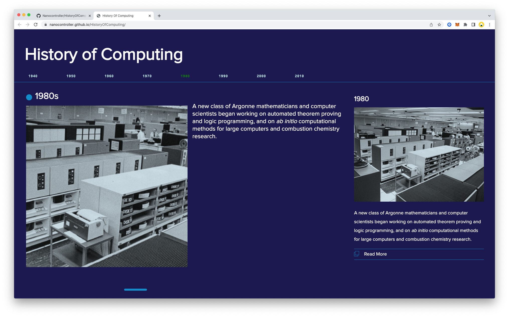

# History Of Computing

## Project Description

This project uses [a google spreadsheet](https://docs.google.com/spreadsheets/d/1u_ZMDIF0vk718AzKeD3iGzv5BXSBvxNJdlmltV7HGl0/edit?usp=sharing) with data from events in the history of computing. 
The data is exported in JSON format and used to generate the timeline with JavaScript and formatted with css. 

## Updating content
There are three main steps to updating content on the website:

1. Preparing images
2. Editing content on the google spreadsheet
3. Updating files to the project folder

---

## Updating and editing the timeline:

### 1. Preparing images:
Every year addition considers at least an image represeting the event. The images shuold have an aspect ratio of 16:9, and can be in full color or b&w.

#### There are two templates provided for **image preparation** 
- [Figma template](https://www.figma.com/file/W8ChwB3qHAnRvmBoTpsqk0/History-of-Computing---Template?node-id=0%3A1) 
- [Photoshop template](https://drive.google.com/drive/folders/17NApWjLOzARIUxsEhXs5ns6BUC-oxgtH?usp=sharing)

#### Naming convention:
- Export featrue image (recommended naming convention: ft + year + ".png" 
> example: **ft1990.png** )
- Export people icon image (recommended naming convention: th + name + ".png" 
> example: **th_LastName.png** )

### 2. Editing content on the google spreadsheet:
The spreadsheet is designed to accommodate multiple events within the same year. If there is only one event, the rest of the cells shuold be blank.

| Year | Decade | feature_Text | feature_Img | event1_Text | xxx |
| --- | --- | --- | --- | --- | --- |
| Year of event | decade | highlight feature info | Image | event | so on... |
| yyyy | yyyy |  Max 250 char. | ft1990.png | 3 | 4 | 
| 1940 | 1940s |  Lorem ipsum dolor sit amet, posse omnium fastidii per ad, pri ne vocibus theophrastus. Ut nisl assueverit qui, facer omnesque moderatius cu pri. Ubique admodum ea eum. | ft1940.png | 3 | 4 | 

1. **Editing text**
	- *decade_text* (summary text for the decade): Max 250 characters
	- *feature_text* (description text for the specific year): Max 250 characters
	- *event*: Event description, smax 250 characters
	- *system*: System description, max 250 characters
	- *personName*: First LastName
	- *personTitle* Title

1. **Exporting JSON file format**
		- google spreadsheet -> Export JSON [(video instruction)](https://drive.google.com/file/d/1ZViOpQgwrdB-Kl7UiYf7MBo0cRa93zLl/view?usp=sharing)
		
### 3. Updating files to the project folder:
1. Replace existing "data.json" file
2. Upload new images to the images folder

---

## Previews 

